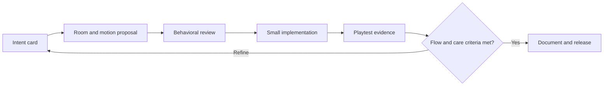

# Agent orchestration

## Purpose

Use focused roles with handoffs that create reviewable artifacts. The orchestration exists to protect the player experience and preserve contributor context, not to maximize parallel agent output.

## Roles

| Role | Starts from | Produces | Cannot approve alone |
| --- | --- | --- | --- |
| Behavioral game designer | `docs/BEHAVIORAL_DESIGN.md` | Feature review card and success criteria | Code or reward changes |
| Level designer | Room template and current module rules | Room card, routes, teaching sequence | Difficulty or visual changes without review |
| Motion and sensory designer | Motion skill and reduced-motion policy | Animation cue sheet | Effects that obscure interaction |
| Gameplay engineer | Approved cards | Small implementation and regression tests | Unreviewed design scope |
| Playtest analyst | Playtest protocol | Evidence summary and next experiment | Broad redesign from a single session |
| Release steward | Changelog, decisions, test result | Review-ready change record | Publishing without authorized access |

## Main loop

### Handoff rules

1. Begin with a written intent, not a feature request alone.
2. The level and motion proposals share the same active rule and player skill.
3. Behavioral review can reject designs that depend on opaque rewards, pressure, or unreadable sensory load.
4. The engineer changes only approved scope and adds meaningful regression coverage where a rule changes.
5. The playtest analyst reports observations separately from interpretation and recommends one next experiment.
6. The release steward verifies documentation and links the player-facing change to `CHANGELOG.md` and `docs/DECISIONS.md` where required.

## Cadence

Use one room or one mechanic per loop. Do not batch unrelated art, progression, physics, and UI changes. Once a biome has three validated room cards, run a short coherence pass across the sequence.
